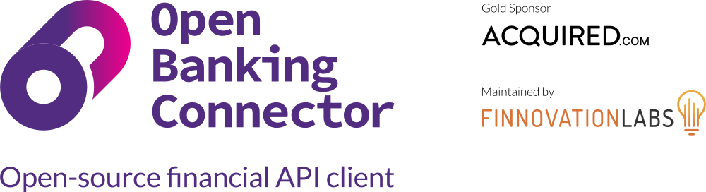

  

 

Open Banking Connector is a *fully open-source*,
*free-to-use* UK Open Banking client (connection layer) that simplifies connections to UK Open Banking APIs.

The official documentation website is [here](https://docs.openbankingconnector.io/). It is generated from the Markdown
source code in the docs directory of this repo.

Releases can be found [here](https://github.com/finlabsuk/open-banking-connector/releases).

Docker images can be
found [here](https://github.com/finlabsuk/open-banking-connector/pkgs/container/open-banking-connector-web-app).

Open Banking Connector is maintained by Finnovation Labs. We are a Cambridge, UK-based company building technology that
makes Open Banking and new bank APIs easier to use.

We wish to thank NewDay Cards for support given to this project.
