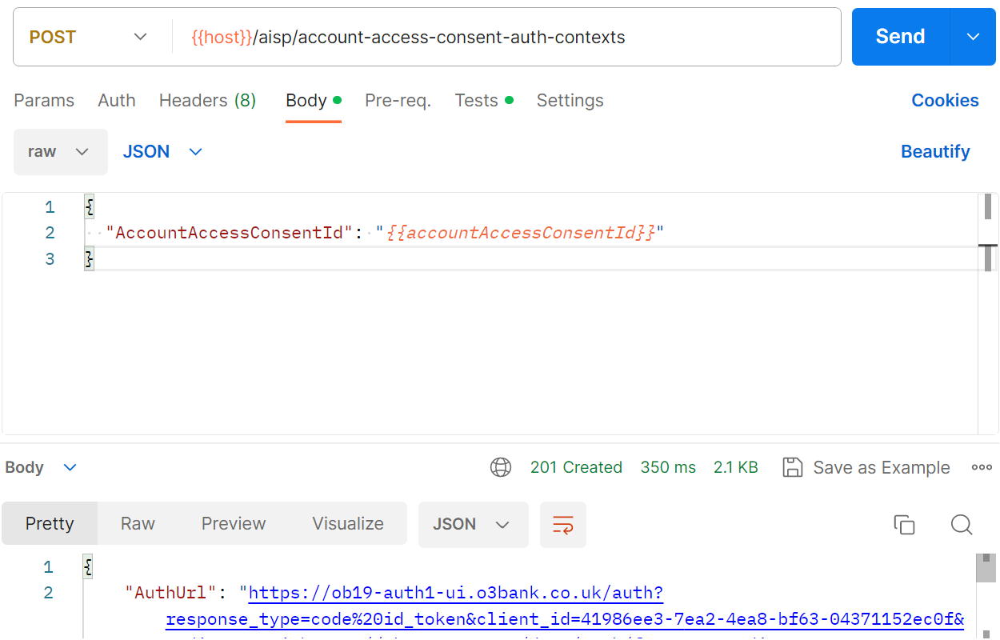
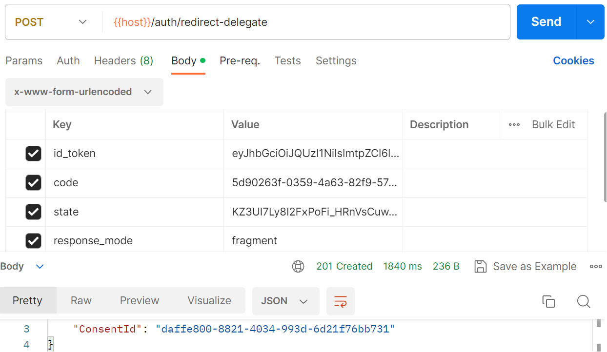

# Create and authorise an account access consent

To access end-user account data, you must first create and authorise an account access consent.

For demonstration purposes, here we will use manual browser end-user auth (i.e. cut and paste auth URL into browser) which is suitable for sandboxes such as the OBIE Modelo model bank.

Supporting end-user auth with real banks requires creating a suitable app - please see [here](../../guide/README.md#open-banking-connector-supports-end-user-auth-in-your-app) for more info.

## Create an account access consent

An account access consent specifies the permissions that you seek the end-user to authorise. Since the available permissions differ between banks, Open Banking Connector allows you to use the template "MaximumPermissions" as an alternative to listing them explicitly.

This template alongside the bank registration ID can be used to create an account access consent.

Upon creation, Open Banking Connector will provide you with an ID for the account access consent which you can then use to create an auth context (auth session) and, following auth, get account data.

### Example with Postman and OBIE Modelo model bank

## Create an auth context

Create an auth context (auth session) for your account access consent to begin end-user auth.

Upon creation, Open Banking Connector will provide you with an auth URL for end-user auth.

### Example with Postman and OBIE Modelo model bank

## Perform end-user auth

To perform manual end-user auth (suitable for sandboxes), copy the auth URL into a browser and go through authentication.

When this is complete you will be redirected back to your redirect URL, which by default will be the default fragment redirect URL from the software statement profile used when creating the consent's bank registration. Even if no web page exists at this URL, you can still copy the URL fragment from your browser to obtain the bank redirect data. 

## Supply redirect data to Open Banking Connector

To complete end-user auth, pass on to Open Banking Connector the bank redirect data supplied by the bank as a fragment appended to the redirect URL. This needs to be done within 10 minutes of auth context creation or you will need to create a new auth context and attempt auth again.

Upon receipt and successful validation of bank redirect data, Open Banking Connector will obtain tokens for the consent in preparation for requests to get account data.

### Example with Postman and OBIE Modelo model bank

