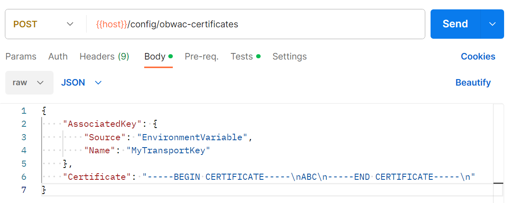
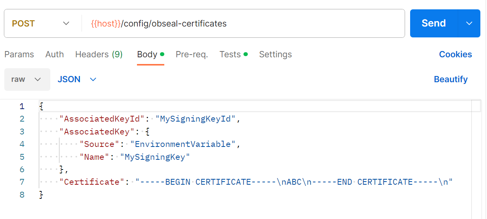
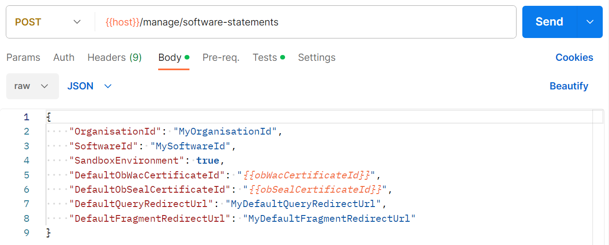

# Add software statement and certificates

Before creating a bank registration, you will need to add at least one software statement to Open Banking Connector.

Each software statement needs to refer to both an OBWAC transport certificate and OBSeal signing certificate - these will then be used with the software statement.

So you will also need to add at least one OBWAC transport certificate and at least one OBSeal signing certificate to Open Banking Connector. And these should be added before any software statement that refers to them.

## Add an OBWAC transport certificate

An OBWAC transport certificate is used for mutual TLS when communicating with banks.

You can add an OBWAC transport certificate using the `POST /config/obwac-certificates` endpoint.

Upon adding, Open Banking Connector will provide you with an ID for the OBWAC transport certificate which you can then use when adding a software statement.

### Example Postman request

## Add an OBSeal signing certificate

An OBSeal signing certificate and its associated key is used to sign and validate JWTs sent to banks.

You can add an OBSeal signing certificate using the `POST /config/obseal-certificates` endpoint.

Upon adding, Open Banking Connector will provide you with an ID for the OBSeal signing certificate which you can then use when adding a software statement.

### Example Postman request

## Add a software statement

In UK Open Banking, a software statement represents an application identity that can create registrations (OAuth2 clients) with banks. A third-party provider (TPP) can create and use multiple software statements and this is fully supported by Open Banking Connector.

You can add a software statement using the `POST /config/software-statements` endpoint.

Upon adding, Open Banking Connector will provide you with an ID for the software statement which you can then use when creating a bank registration.

### Example Postman request

