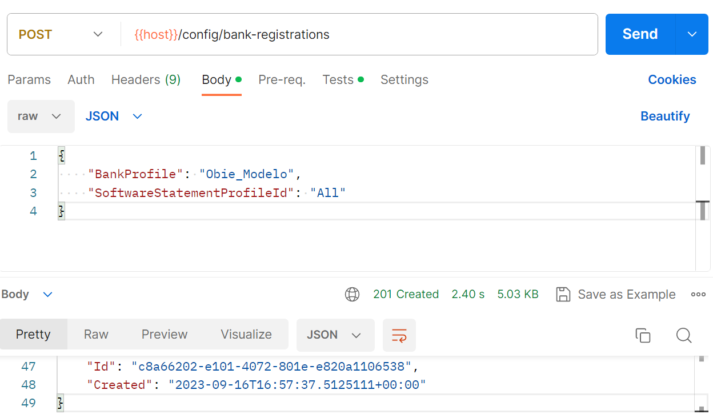

# Create a bank registration

To access Open Banking APIs provided by a bank, you need to create a bank registration (OAuth2 client) which establishes a relationship between you and the bank.

To do this, first identify the *bank profile* for the bank you wish to connect to. Bank profiles are listed in the [bank integrations table](../../bank-integrations.md).

Each bank registration requires the ID of a previously-added [software statement](../add-software-statement-and-certificates/README.md).

You can then use the bank profile and software statement ID to create a new bank registration.

Upon creation, Open Banking Connector will provide you with an ID for the bank registration which you can then use to create consents.

## Example with Postman and OBIE Modelo model bank

